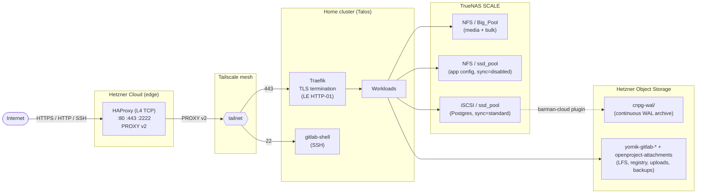

# sharkshere-gitops

GitOps control plane for the sharkshere homelab platform — a 4-node Talos Kubernetes cluster reconciling ~40 ArgoCD Applications that serve 14+ public HTTPS domains end-to-end, including self-hosted **GitLab CE** (with container registry on `registry.git.yornik.eu` and git-over-SSH on `:2222`), **OpenProject**, **Vaultwarden**, **Jellyfin**, and a Fediverse instance.

Traffic enters via two Hetzner edge nodes (HAProxy L4 TCP with PROXY v2 preserving real client IPs), tunnels through a Tailscale mesh, and terminates TLS at in-cluster Traefik via ACME (Let's Encrypt HTTP-01).

This repo is one of three:

| Repo | Layer | Responsibility |
|---|---|---|
| [`jumpingsharks`](https://github.com/Yornik/jumpingsharks) | infrastructure | provisions Hetzner edge hosts + DNS/rDNS via OpenTofu |
| [`sharkshere-ansible`](https://github.com/Yornik/sharkshere-ansible) | hosts | hardens edge hosts, deploys HAProxy + Tailscale + fail2ban |
| `sharkshere-gitops` (this repo) | workloads | reconciles in-cluster apps + runtime policy via ArgoCD |

## At a glance

| Metric | Value |
|---|---|
| Nodes | 4× Intel N150 (3 control-plane + 1 worker, all schedulable), Talos Linux |
| Memory | 128 GiB cluster total |
| Workloads | ~40 ArgoCD Applications, ~14 public HTTPS domains |
| Postgres | 3 dedicated CloudNativePG Clusters (shared / OpenProject / GitLab), 3-instance HA each |
| Object storage | 8 buckets in Hetzner Object Storage (WAL archive + per-app backends) |
| Edge | 2 Hetzner jump hosts (Nuremberg + Helsinki) with HAProxy L4 + Tailscale |
| Storage backend | TrueNAS SCALE (7-disk raidz1 HDD pool + 2-disk SSD mirror) over NFS + iSCSI + SMB |
| Logs | Alloy (DaemonSet) → Loki (60-day retention, 30 GiB store) |
| Metrics | kube-prometheus-stack + Grafana with file-provider dashboards |
| Secrets | SOPS + age, decrypted in-cluster by KSOPS in the ArgoCD repo-server |

## Traffic + state flow



## Engineering highlights

- **Per-app CloudNativePG pattern.** `shared-pg` hosts multi-tenant app DBs; OpenProject and GitLab CE each get their own dedicated 3-instance HA Cluster so a runaway migration on one doesn't touch the others. All three ship continuous WAL archive + scheduled base backup to Hetzner Object Storage via the barman-cloud plugin.
- **iSCSI over NFS for Postgres.** Block storage on `ssd_pool` with `sync=standard` gives real per-commit `fsync` durability — pgbench notes in `manifests/shared-pg/` document the comparison that drove the decision.
- **Valkey, not Bitnami Redis.** GitLab chart 10.0 dropped its bundled Redis subchart, and the Bitnami chart went paid in Sept 2025. The cache + queue tier runs the official Valkey chart from `valkey.io` (Linux Foundation Redis fork) with iSCSI persistence.
- **GitLab on chart 10.0 the week it released.** External CNPG + Valkey + Hetzner S3 (six dedicated `yornik-gitlab-*` buckets across **three** different Secret schemas — Rails Fog YAML for `appConfig`, docker registry `config.yml` for the registry, s3cmd INI for backup tarballs). Container registry and git-over-SSH on dedicated subdomains.
- **Tailscale operator for inbound SSH.** `gitlab-shell` is exposed via `tailscale.com/expose` so HAProxy on the jump hosts reaches it over the mesh on `:22` — externally surfaced as `:2222` because the jump host's own sshd keeps `:22`.
- **GitHub webhook + ArgoCD prune+selfHeal** means a merge to `main` reconciles within seconds — not 3-minute polling.
- **SOPS + KSOPS** for in-cluster secret decryption. `.enc.yaml` files are decrypted by the repo-server init container with an age key mounted as a Secret; no plaintext secrets at rest or in git.
- **PR-gated everything**: yamllint + helm template + kubeconform (raw + rendered) before merge.

## Repository layout

```text
apps/           app-of-apps chart producing Argo CD Applications
bootstrap/      Argo CD bootstrap manifests (cluster-zero state)
manifests/      per-app manifests and Kustomize overlays
```

## Reconciliation Model

1. Bootstrap installs Argo CD and root app.
2. Root app renders one `Application` per entry in `apps/values.yaml`.
3. Argo CD continuously enforces desired state (prune + selfHeal).
4. **GitHub webhook** → `https://argocd.fedishark.eu/api/webhook` triggers an immediate sync on every push to `main`, so ArgoCD reconciles within seconds of a merge rather than waiting for the default 3-minute polling interval.

## Application Inventory

### Local manifests

| App | Namespace | Purpose |
|-----|-----------|---------|
| `local-path-provisioner` | `local-path-storage` | node-local default storage class |
| `external-dns` | `external-dns` | DNS automation for `fedishark.eu` + `yornik.eu` |
| `monitoring` | `monitoring` | monitoring namespace, ingress, secrets |
| `tibber-exporter` | `monitoring` | energy metrics exporter |
| `gotosocial` | `gotosocial` | fediverse service (`pub.fedishark.eu`) |
| `jellyfin` | `jellyfin` | media service (`jelly.yornik.eu`) |
| `omni-tools` | `omni-tools` | utility services |
| `qbittorrent` | `jellyfin` | torrent workload |
| `democratic-csi` | `democratic-csi` | CSI config bootstrap |
| `muse` | `muse` | app workload |
| `argocd-config` | `argocd` | ArgoCD IngressRoute + fail2ban middleware |
| `vaultwarden` | `vaultwarden` | password manager (`passwords.yornik.eu`) |
| `vikunja` | `vikunja` | task management (`todo.yornik.eu`) |
| `asf` | `asf` | app workload |
| `fedishark` | `fedishark` | public landing site |
| `yornik` | `yornik` | professional site (`yornik.eu`) |
| `privatebin` | `privatebin` | secure paste service (`secrets.yornik.eu`) |
| `traefik-config` | `traefik` | shared edge middleware and `security.txt` |
| `tailscale` | `tailscale` | cluster-side tailscale resources |
| `shared-pg` | `shared-pg` | multi-tenant CNPG Postgres Cluster (3-instance HA, WAL archive to Hetzner OS) — hosts app databases that don't need their own dedicated cluster |
| `openproject-pg` | `openproject` | dedicated CNPG Postgres Cluster for OpenProject (3-instance HA, WAL archive to Hetzner OS) |
| `gitlab-pg` | `gitlab` | GitLab CE supporting resources — CNPG `gitlab-pg` Cluster (3-instance HA, 20Gi data + 10Gi WAL, WAL archive to Hetzner OS), IngressRoutes for `git.yornik.eu` + `registry.git.yornik.eu`, Tailscale-exposed `gitlab-shell` Service for SSH on `:2222`, and the SOPS Secrets the chart consumes (S3 buckets, registry storage, SMTP, initial root password) |

### Helm apps

| App | Namespace | Chart |
|-----|-----------|-------|
| `smb-csi-driver` | `kube-system` | `csi-driver-smb` |
| `kube-prometheus-stack` | `monitoring` | `kube-prometheus-stack` |
| `loki` | `monitoring` | `loki` |
| `alloy` | `monitoring` | `alloy` |
| `democratic-csi-nfs` | `democratic-csi` | `democratic-csi` |
| `democratic-csi-nfs-ssd` | `democratic-csi` | `democratic-csi` |
| `democratic-csi-iscsi` | `democratic-csi` | `democratic-csi` |
| `democratic-csi-iscsi-ssd` | `democratic-csi` | `democratic-csi` |
| `traefik` | `traefik` | `traefik` |
| `tailscale-operator` | `tailscale` | `tailscale-operator` |
| `cnpg-operator` | `cnpg-system` | `cloudnative-pg` |
| `cnpg-plugin-barman-cloud` | `cnpg-system` | `plugin-barman-cloud` |
| `cert-manager` | `cert-manager` | `cert-manager` |
| `openproject` | `openproject` | `openproject` |
| `gitlab-valkey` | `gitlab` | `valkey` (official `valkey/valkey` from `valkey.io`) |
| `gitlab` | `gitlab` | `gitlab` (CE, chart 10.0) |
| `gitlab-runner` | `gitlab` | `gitlab-runner` (kubernetes executor) |

## Storage classes

| StorageClass | Protocol | Backing pool | Notes |
|--------------|----------|--------------|-------|
| `truenas-nfs` (default) | NFS | `Big_Pool` raidz1 (7× HDD) | Jellyfin media, GoToSocial storage, Vikunja files — bulk/sequential IO only |
| `truenas-ssd` | NFS | `ssd_pool` mirror (2× Samsung 870 EVO 1 TB) | App PVCs — config, attachments, small state (dataset `sync=disabled`, fast but RAM-buffered) |
| `truenas-ssd-iscsi` | iSCSI | `ssd_pool` mirror | CNPG Postgres Clusters — ext4 on zvol with `sync=standard` for real per-commit durability |
| `truenas-iscsi` | iSCSI | `Big_Pool` | Block storage (HDD-backed, rarely used) |
| `smb` | SMB | `Big_Pool/Share` | Jellyfin media read-only |
| `smb-rw` | SMB | `Big_Pool/Share` | qBittorrent downloads read-write |
| `local-path` | hostPath | Node-local | Jellyfin config (node-pinned) |

## Public surface

| Domain | Service |
|---|---|
| `yornik.eu` | professional site |
| `fedishark.eu` | landing site |
| `pub.fedishark.eu` | GoToSocial (Fediverse) |
| `grafana.fedishark.eu` | Grafana |
| `argocd.fedishark.eu` | ArgoCD UI + webhook receiver |
| `asf.fedishark.eu` | ArchiSteamFarm |
| `omni.fedishark.eu` | omni-tools |
| `jelly.yornik.eu` | Jellyfin |
| `passwords.yornik.eu` | Vaultwarden |
| `todo.yornik.eu` | Vikunja |
| `secrets.yornik.eu` | PrivateBin |
| `plan.yornik.eu` | OpenProject |
| `git.yornik.eu` | GitLab CE (web + git over HTTPS + git over SSH on `:2222`) |
| `registry.git.yornik.eu` | GitLab Container Registry |

ExternalDNS manages all subdomains for `fedishark.eu` and `yornik.eu`. Apex records are managed via dummy Services in `manifests/external-dns/dns-records.yaml`, pointing directly at the jump host IPs (Cloudflare CNAME flattening conflicts with DANE TLSA, which is selectively applied where it provides practical value).

## Bootstrap

Prerequisite: `kubectl` context with cluster access.

```sh
kubectl apply -f bootstrap/argocd-namespace.yaml
kubectl apply --server-side --force-conflicts -k bootstrap/argocd/
sops -d bootstrap/argocd-secret.enc.yaml | kubectl apply -f -
kubectl apply -f bootstrap/argocd-project.yaml
kubectl apply -f bootstrap/root-app.yaml
```

(Detailed bootstrap + upgrade procedures live in `CLAUDE.md`.)

## Secrets

Secrets are encrypted with SOPS (`*.enc.yaml`) and decrypted during sync via KSOPS. The age private key is mounted into the ArgoCD repo-server init container; nothing plaintext lives in git.

## CI

PR checks (run on every PR to `main`):

1. YAML lint (`yamllint`)
2. Helm template (`helm template apps/`)
3. Kubeconform on raw manifests
4. Kubeconform on rendered Helm output

Average run: ~10 seconds.

## Dependency updates

Renovate is enabled. Patch + docker minor updates are auto-merged. Helm chart bumps open a PR with the `major` label when crossing a major; chart-cm changes require human review.

## Homelab constraints

Known single points of failure:

- Single residential power feed
- Single residential internet uplink
- Shared NAS-backed storage dependency for part of the stateful workload set

A UPS on the cluster, NAS, and home router doesn't actually solve the power-outage failure mode — when neighborhood power drops, the ISP's street-cabinet equipment (DSLAM / GPON / DOCSIS amplifier) typically loses power within minutes too. Local battery backup keeps the cluster *running* but with no upstream connectivity, which serves nobody. Real mitigation needs a second independent uplink (LTE/5G failover with its own battery), and at that point dual power becomes the smaller problem.

These are intentional tradeoffs for a homelab budget/complexity envelope. Full mitigation (dual power path, genuinely independent dual WAN with edge failover, fully independent replicated storage domains) is feasible but currently disproportionate in cost and operational overhead for this environment.
